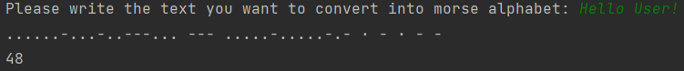

### Text to Morse code

I followed this Udemy Course: https://www.udemy.com/course/100-days-of-code/

This course finalises with 20 challenges covering all aspects which were introduced during this course.

This project covers the challenge from day 81 (first challenge). One of those challenges was building my own website:
https://jarmo2.github.io/ 
On this website you can find all the projects I have built inspired by _100 days of code_
The instructions given for this project were as follows:
_A text-based Python program to convert Strings into Morse Code._

#### There are two versions of the _Text to morse code_ project:
- The code in the directory morse_code is quite simple. All you need to do is run the Python script.
By typing the text to be converted via the console of your IDE, you can see what your text looks like in morse code.-
- The code in the directory pimped_version with_sound follows the same logic as the simplified version but executes the morse code as sound.
### Badges

#### 1. GitHub Stats
[My repository stats](https://github-readme-stats.vercel.app/api?username=Jarmo2&show_icons=true)
#### 2. Most Used Languages

##### 4. Random Joke Generator

##### 4. Profile View Counter

### Visuals

### Installation

For the simple version (morse_code) you only need Python.
For the extended version (pimped_version_with_sound) you need to install the following packages:
- pip install sounddevice
- pip install numpy
### Usage

This little project is help to see a dictionary comprehension in action and to see how you can write something semi-useful with a few lines of code.

### Support

If you need help or if you have a comment please feel free to leave a comment on Github.

### License

gpl-3.0