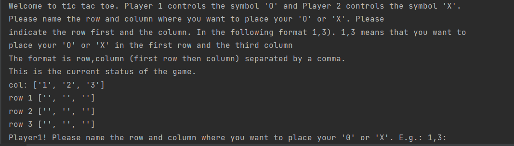

### Tic Tac Toe

I followed this Udemy Course: https://www.udemy.com/course/100-days-of-code/

This course finalises with 20 challenges covering all aspects which were introduced during this course.

This project covers the challenge from day 83 (third challenge). One of those challenges was building my own website:
https://jarmo2.github.io/ 
On this website you can find all the projects I have built inspired by _100 days of code_.
The instructions given for this project were as follows:
_Build a text-based version of the Tic Tac Toe game._

### Badges

#### 1. GitHub Stats
[My repository stats](https://github-readme-stats.vercel.app/api?username=Jarmo2&show_icons=true)
#### 2. Most Used Languages

##### 3. Random Joke Generator

##### 4. Profile View Counter

### Visuals

### Installation

For this simple program you only need Python and no additional libraries.

### Usage

This game is a little time machine to the early stages of computing. However, it helped me to understand how to:
- use list comprehension
- use nested functions
- think about possible mistakes a user can make while typing to the terminal.

### Support

If you need help or if you have a comment please feel free to leave a comment on Github.

### License

gpl-3.0