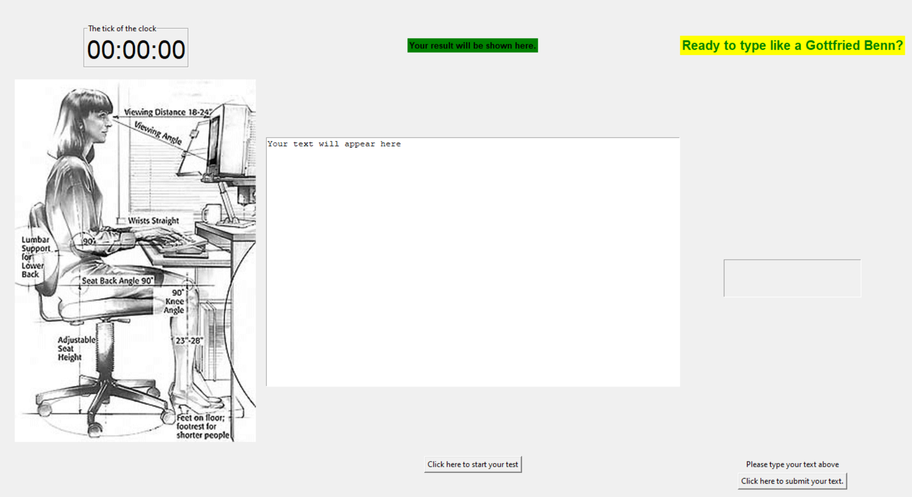
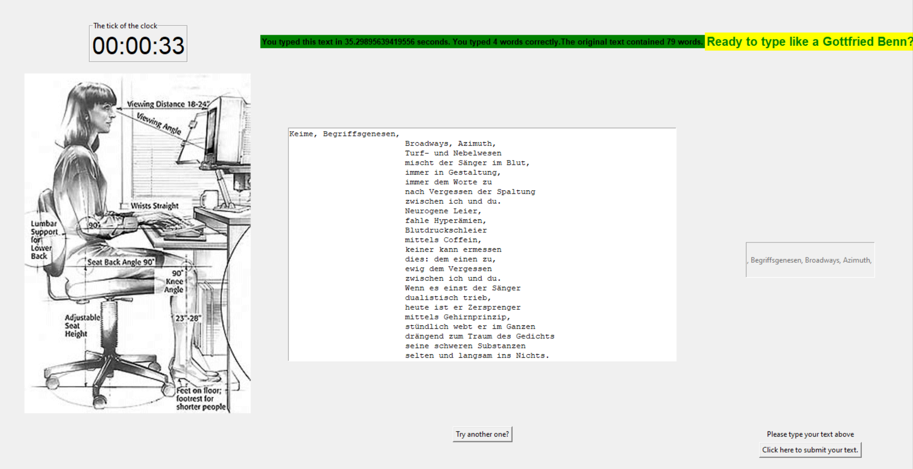

### Typing Speed Detector with a GUI

I followed this Udemy Course: https://www.udemy.com/course/100-days-of-code/

This course finalises with 20 challenges covering all aspects which were introduced during this course.

This project covers the challenge from day 85 (fifth challenge). One of those challenges was building my own website:
https://jarmo2.github.io/ 
On this website you can find all the projects I have built inspired by _100 days of code_.
The instructions given for this project were as follows:
_A Tkinter GUI desktop application that tests your typing speed._

### Badges

#### 1. GitHub Stats
[My repository stats](https://github-readme-stats.vercel.app/api?username=Jarmo2&show_icons=true)
#### 2. Most Used Languages

##### 3. Random Joke Generator

##### 4. Profile View Counter

### Visuals
Starting screen

End Screen

### Installation

For this simple program you need Python and the following libraries:
- Tkinter
- random
- datetime

### Usage

This program displays a poem of the German poet Gottfried Benn. I got to know about him and his poems during my
last years at school. https://en.wikipedia.org/wiki/Gottfried_Benn

As soon as you start the game, a poem will appear. You can type the words in the respective text field.
Please note that the detection of the correctness of your typed words is case-sensitive.

The program uses a string method to detect the words typed. Please note that commas and fullstops/periods are not a separate word.
They are part of the preceding word. Your typed word must match the shown word 100%. Otherwise, the word does not count as correct.

This program is helpful from a programmer's point of view as this program involves:
- object-oriented programming
- the difficulties to align a loop of a stopwatch, and a loop needed for Tkinter (the Tkinter refresh)
- string methods
- the interaction of Python code written in separate modules.
- lambda functions used to call more than one function with a tkinter button

### Support

If you need help or if you have a comment please feel free to leave a comment on Github.

Please note that this is a beta version. In the upcoming edits I will fix:
- the alignment of the text to type
- make the stopwatch and the internal timer align
- make the text field to enter your text larger.

### License

gpl-3.0