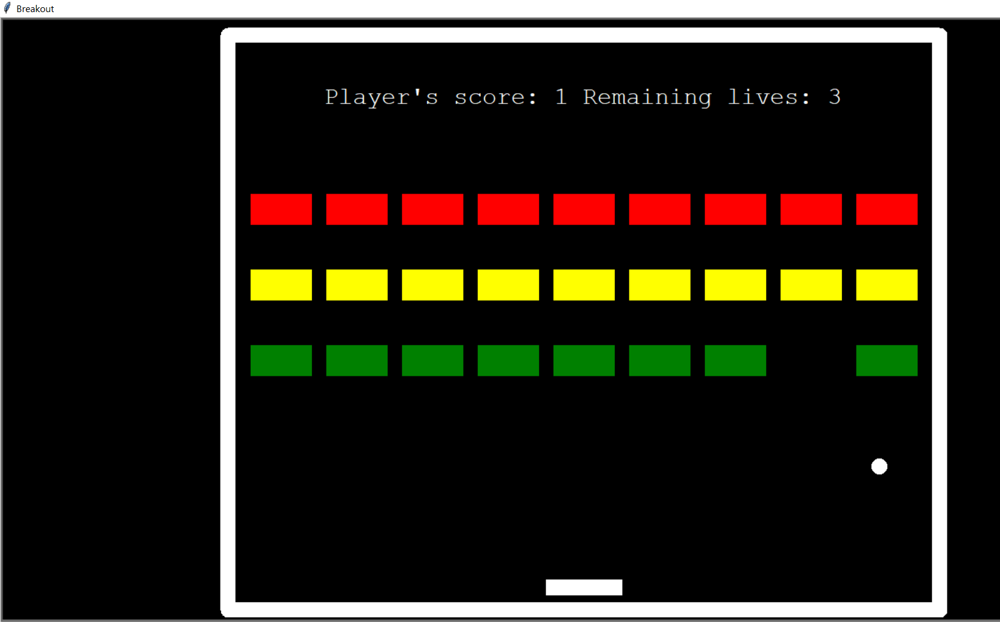
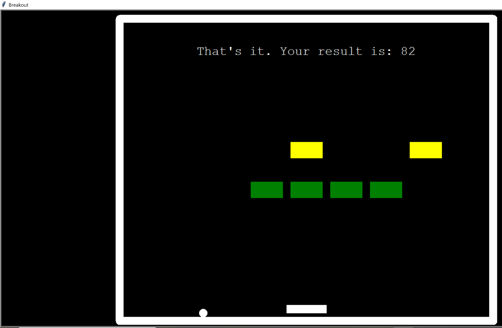
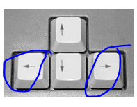

### Breakout Game

I followed this Udemy Course: https://www.udemy.com/course/100-days-of-code/

This course finalises with 20 challenges covering all aspects which were introduced during this course.

This project covers the challenge from day 86 (sixth challenge). One of those challenges was building my own website:
https://jarmo2.github.io/ 
On this website you can find all the projects I have built inspired by _100 days of code_.
The instructions given for this project were as follows:
_Using Python Turtle, build a clone of the 80s hit game Breakout._

This program helped me to understand the concept of object-oriented programming better and how code written in different modules can interact.
I also learnt how to use the all() function. I used it to determine whether the game is won.

### Badges

#### 1. GitHub Stats
[My repository stats](https://github-readme-stats.vercel.app/api?username=Jarmo2&show_icons=true)
#### 2. Most Used Languages

##### 3. Random Joke Generator

##### 4. Profile View Counter

### Visuals
Starting screen

End Screen

### Installation

For this simple program you need Python and the following libraries:
- tkinter
- numpy
- time
- turtle

### Usage

This program is a simple clone of the legendary video game breakout: https://en.wikipedia.org/wiki/Breakout_(video_game)

Once you let the file _main.py_ run, please enlarge the window. The only thing you need to do then is controlling the paddle
at the bottom of your screen with arrow keys left and right.

The speed of the ball increases once it touches the yellow, orange or red rows. The points to get increase from green to red.

Please have a look at the picture below. The arrow keys are in the blue circles.

The game ends once you lost all your lives, or you eliminated all bricks to hit.

### Support

If you need help or if you have a comment please feel free to leave a comment on Github.

This version is stable. As I progress in my coding I will review the OOP code to see whether it can be simplified.

### License

gpl-3.0