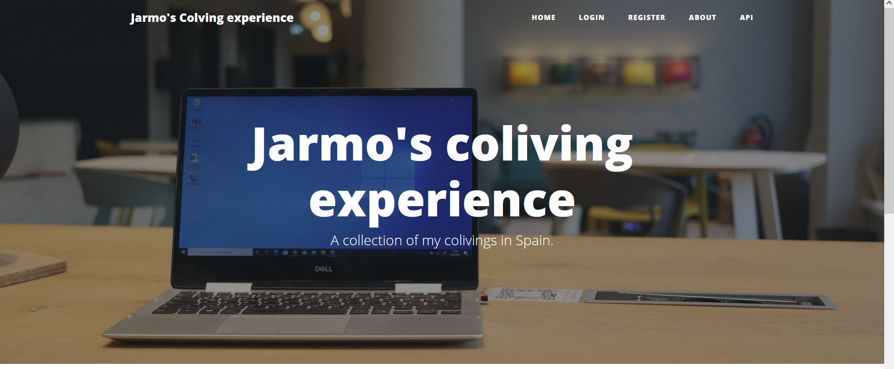

### Dynamic Website about Colivings in Spain

I followed this Udemy Course: https://www.udemy.com/course/100-days-of-code/

This course finalises with 20 challenges covering all aspects which were introduced during this course.

This project covers the challenge from day 87 (7th challenge). One of those challenges was building my own website:
https://jarmo2.github.io/ 
On this website you can find all the projects I have built inspired by _100 days of code_.
The instructions given for this project were as follows:
_Build a website that lists cafes with wifi and power for remote working._

I modified this idea to reflect better my own experiences:

_So, I build a website that lists all colivings and hostels with remote working amenities that I have visited during my journey._

For this program I used the Flask framework and set up a database structure with the help of SQLAlchemy (here flask_sqlalchemy was used).
In addition, I could deepen my understanding of decorators. 
I also learnt a lot about security like the use of secret keys and hashed passwords.

### continue from here

### Badges

#### 1. GitHub Stats
[My repository stats](https://github-readme-stats.vercel.app/api?username=Jarmo2&show_icons=true)
#### 2. Most Used Languages

##### 3. Random Joke Generator

##### 4. Profile View Counter

### Visuals
Starting screen

### Installation

For this simple program you need Python and the following libraries:
- flask
- flask_bootstrap 
- werkzeug.security 
- flask_sqlalchemy 
- sqlalchemy.orm 
- flask_login 
- functools 
- datetime 
- flask_ckeditor
- random

### Usage

To run this program you need to execute the main.py file. The functionality is similar to a blog.

### Support

If you need help or if you have a comment please feel free to leave a comment on Github.

This version is stable. I will add more colivings in the future.
As a learning path, I noticed that I still have to learn how decorators work in all aspects.
Also, I wanted to add a commenting section and host this website with the help of Heroku.

As an upgrade an API feature will be implemented.

### License

gpl-3.0