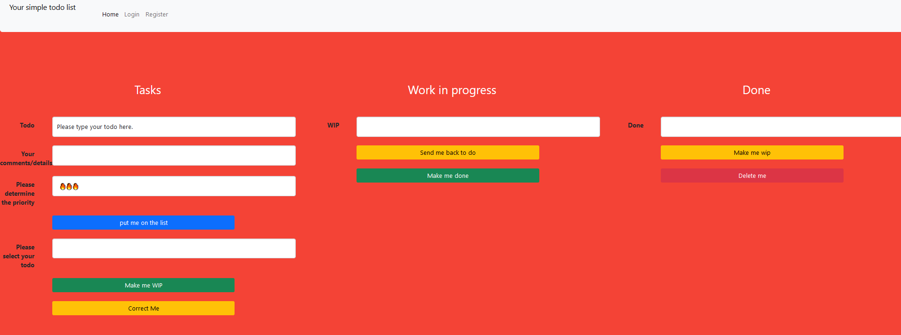

### Todo List

I followed this Udemy Course: https://www.udemy.com/course/100-days-of-code/

This course finalises with 20 challenges covering all aspects which were introduced during this course.

This project covers the challenge from day 88 (8th challenge). One of those challenges was building my own website:
https://jarmo2.github.io/ 
On this website you can find all the projects I have built inspired by _100 days of code_.
The instructions given for this project were as follows:
_Build a todo list website._

For this program I used the Flask framework and set up a database structure with the help of SQLAlchemy (here flask_sqlalchemy was used).

I learnt here how I can make a website which reacts to information which is entered on one field on the website and shows this information
on another part of the website.

### Badges

#### 1. GitHub Stats
[My repository stats](https://github-readme-stats.vercel.app/api?username=Jarmo2&show_icons=true)
#### 2. Most Used Languages

##### 3. Random Joke Generator

##### 4. Profile View Counter

### Visuals
Starting screen

### Installation

For this simple program you need Python and the following libraries:
- flask
- flask_bootstrap 
- werkzeug.security 
- flask_sqlalchemy 
- sqlalchemy.orm 
- flask_login
- datetime

### Usage

To run this program you need to execute the main.py file. The functionality is similar to a normal one page website..

### Support

If you need help or if you have a comment please feel free to leave a comment on Github.

This version is almost stable. The only thing you need to consider is that you need to login first before you can use the todo list
even if it looks like that you can start without login. This bug will be fixed in a later version.

In addition, I will add a functionality which allows you to see the details of each post like comments in the wip and one phase as well.

### License

gpl-3.0