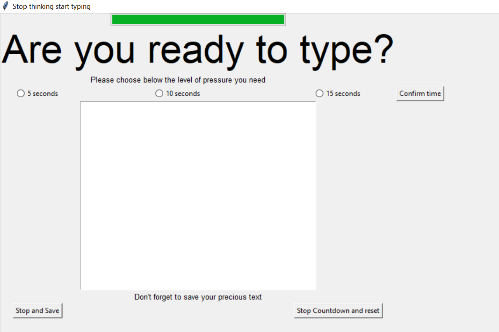
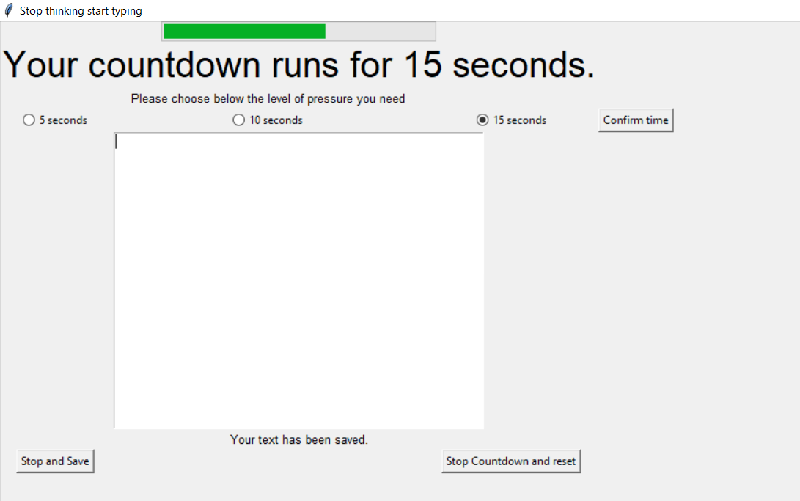

### Disappearing Text Writing App

I followed this Udemy Course: https://www.udemy.com/course/100-days-of-code/

This course finalises with 20 challenges covering all aspects which were introduced during this course.

This project covers the challenge from day 89 (9th challenge). One of those challenges was building my own website:
https://jarmo2.github.io/ 
On this website you can find all the projects I have built inspired by _100 days of code_.
The instructions given for this project were as follows:
_A writing app where if you stop typing, your work will disappear._

For this program I used the tkinter.

I learnt how to save information from tkinter to a txt file and how to make tkinter listen and react if any key is pressed.

### Badges

#### 1. GitHub Stats
[My repository stats](https://github-readme-stats.vercel.app/api?username=Jarmo2&show_icons=true)
#### 2. Most Used Languages

##### 3. Random Joke Generator

##### 4. Profile View Counter

### Visuals
Starting screen

endscreen

### Installation

For this simple program you need Python and the following libraries:
- tkinter
- tkinter.ttk

### Usage

To run this program you need to execute the main.py file. A popup will appear. Your text will be saved to the file _saved.txt_ 
if you wish to save anything.

### Support

If you need help or if you have a comment please feel free to leave a comment on Github.

This version is stable. In a future version I will update the design and create a reset button.

### License

gpl-3.0