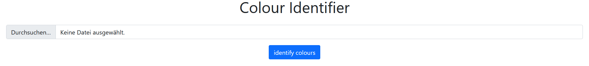
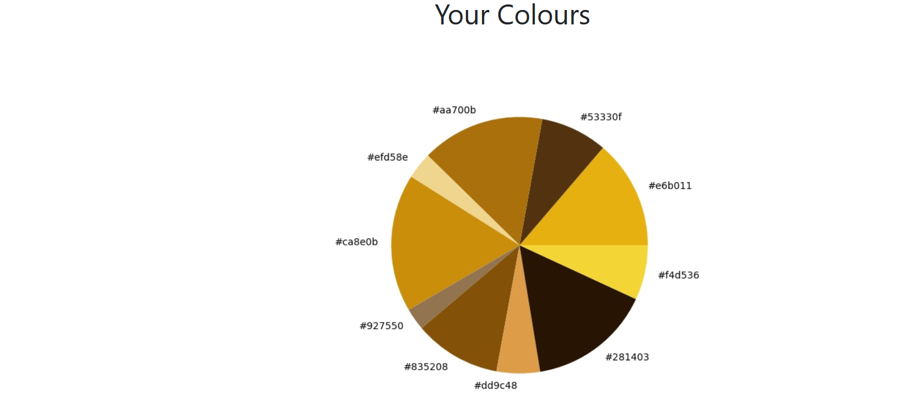

### Image Colour Palette Generator

I followed this Udemy Course: https://www.udemy.com/course/100-days-of-code/

This course finalises with 20 challenges covering all aspects which were introduced during this course.

This project covers the challenge from day 91 (11th challenge). One of those challenges was building my own website:
https://jarmo2.github.io/ 
On this website you can find all the projects I have built inspired by _100 days of code_.
The instructions given for this project were as follows:
_A website that finds the most common colours in an uploaded image._

For this program I used the libraries sklearn.cluster, cv2, collections, flask, PIL, werkzeug.utils, os, matplotlib.pyplot
and pathlib.

This program has two main parts which interact. First there is a Flask app which allows the user to upload a picture.
There is some basic security implemented with the help of werkzeug.utils to avoid that malicious files can be uploaded on the server.

Then there is the Machine Learning part involving cv2 and scikit learn in particular.
Here a clustering technique (KMeans) is used to find the 10 most common color clusters.
Please note as the KMeans cluster is impacted by the choice of the initial clusters, the result can be different for the same picture slightly if you run the program on the same photo twice.

Lastly, a plot is created by matplotlib.pyplot and shown as a picture in the website.

### Screenshots

start

result

### Badges

#### 1. GitHub Stats
[My repository stats](https://github-readme-stats.vercel.app/api?username=Jarmo2&show_icons=true)
#### 2. Most Used Languages

##### 3. Random Joke Generator

##### 4. Profile View Counter

### Installation

For this simple program you need Python and the following libraries:
- sklearn.cluster
- cv2, 
- collections
- flask
- PIL
- werkzeug.utils,
- os
- matplotlib.pyplot
- pathlib

### Usage

To run this program you need to execute the main.py file. 
Then you have to click on the link to the flask server in the terminal.
Please upload then the file you want to analyse.
After doing this the page will refresh, and you see a pie chart with the 10 top colors.

### Support

If you need help or if you have a comment please feel free to leave a comment on Github.

This version is stable. 

### License

gpl-3.0