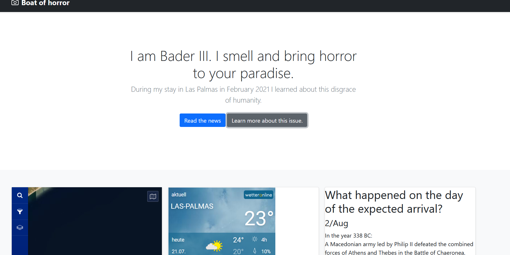

### Custom Web Scraper

I followed this Udemy Course: https://www.udemy.com/course/100-days-of-code/

This course finalises with 20 challenges covering all aspects which were introduced during this course.

This project covers the challenge from day 92 (12th challenge). One of those challenges was building my own website:
https://jarmo2.github.io/ 
On this website you can find all the projects I have built inspired by _100 days of code_.
The instructions given for this project were as follows:
_Build a custom web scraper to collect data on things that you are interested in._

For this program I used beautifulsoup (bs4) to scrap the website vesellfinder.com to find the current location of the ship
Bader III which is a live stock carrier. I added some news about this ship and the live stock carrier issue in general.

Then, I embedded a java script widget from another vessel tracking site to show the current location of Bader III on a map.
With the information I got from vesselfinder.com I feed two other widgets showing the current weather of the current location of Bader III 
and information about historic events which happened on the same date as the expected arrival.

### Badges

#### 1. GitHub Stats
[My repository stats](https://github-readme-stats.vercel.app/api?username=Jarmo2&show_icons=true)
#### 2. Most Used Languages

##### 3. Random Joke Generator

##### 4. Profile View Counter

### Visuals
Starting screen

### Installation

For this simple program you need Python and the following libraries:
- flask
- bs4
- requests
- datetime

### Usage

To run this program you need to execute the main.py file. The functionality is similar to a normal one page website.
Just click on the link in the terminal to access the flask page.

### Support

If you need help or if you have a comment please feel free to leave a comment on Github.

This version is stable. The aim was to show how to make a simple webpage with the help of webscraping.

### License

gpl-3.0