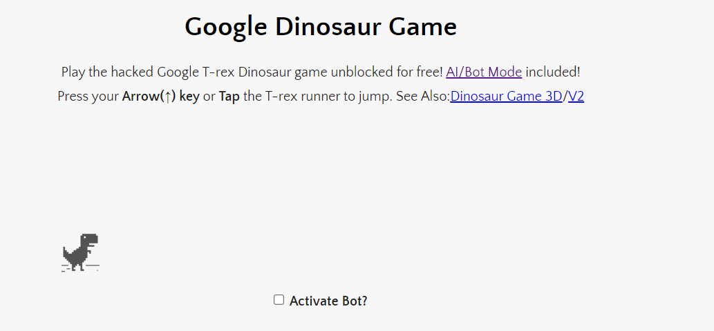

### Automate the Google Dinosaur Game

I followed this Udemy Course: https://www.udemy.com/course/100-days-of-code/

This course finalises with 20 challenges covering all aspects which were introduced during this course.

This project covers the challenge from day 93 (13th challenge). One of those challenges was building my own website:
https://jarmo2.github.io/ 
On this website you can find all the projects I have built inspired by _100 days of code_.
The instructions given for this project were as follows:
_Write Python code to play the Google Dinosaur Game._

This program combines automation with (simple) artificial intelligence.
To run this little bot you need the following:
- Python version less than 3.9 as pyautogui is currently not optimised for the most recent version
- pyautogui
- PIL
- openCV
- numpy
- keyboard

My program has two for loops.

1) While Loop

This while loop makes Python listen to keyboard commands (with the help of the keyboard library).
Please open the [game][ttps://elgoog.im/t-rex/] in a separate browser.
   
Please do not click activate bot as it's not my bot.
Please start the Python code in your IDE.
Please go back to the browser and start the game. Please use tab to start the game and NOT space.
Once the first obstacle is near to the dinosaur please press space.
As from there, the bot takes over and recognises the next obstacles.

Once you press space a screenshot is taken and the program is scanning the screenshot for the position of the obstacle.

2) While loop   

The position of the obstacle is then passed to the second while loop. 
Pyautogui is scanning the position of the first obstacle for other items with the same color. If a grey item is at this position,
it presses space automatically.

### Badges

#### 1. GitHub Stats
[My repository stats](https://github-readme-stats.vercel.app/api?username=Jarmo2&show_icons=true)
#### 2. Most Used Languages

##### 3. Random Joke Generator

##### 4. Profile View Counter

### Visuals

Screenshot which is scanned by opencv

### Installation

For this simple program you need Python and the following libraries:
- Python version less than 3.9 as pyautogui is currently not optimised for the most recent version
- pyautogui
- PIL
- openCV
- numpy
- keyboard

### Usage

This program shows a pretty easy way how to automate a task.
It's not perfect. Sometimes the OSError in pyautogui occurs.
https://stackoverflow.com/questions/59146513/pyautogui-and-pyscreeze-crash-with-windll-user32-releasedc-failed
Please just try again.

### Support

If you need help or if you have a comment please feel free to leave a comment on Github.

### License

gpl-3.0
