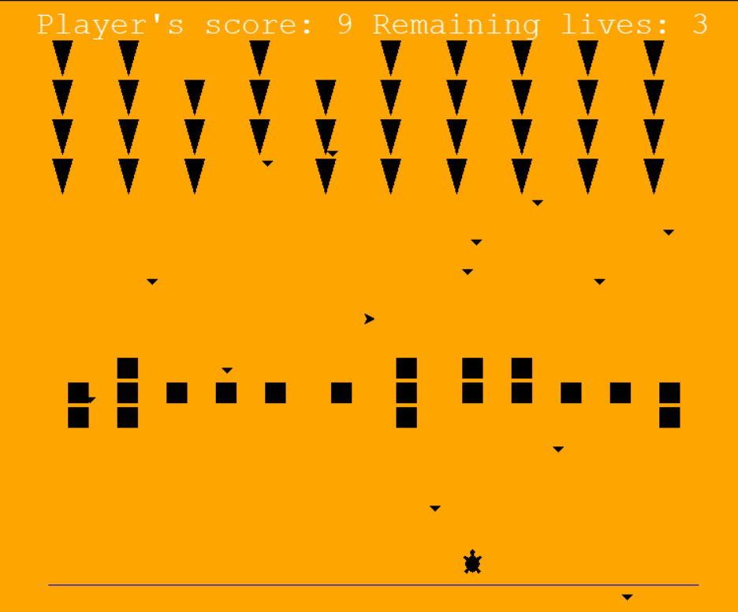
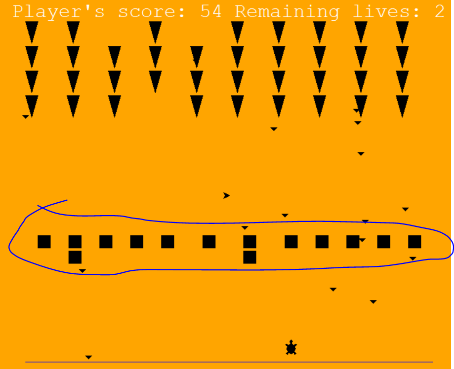

### Space Invaders

I followed this Udemy Course: https://www.udemy.com/course/100-days-of-code/

This course finalises with 20 challenges covering all aspects which were introduced during this course.

This project covers the challenge from day 94 (14th challenge). One of those challenges was building my own website:
https://jarmo2.github.io/ 
On this website you can find all the projects I have built inspired by _100 days of code_.
The instructions given for this project were as follows:
_Build the classic arcade game where you shoot down alien ships._

All you need to start this program is to run main.py.

For me the most difficult part was to figure out how to delay the fire of the evil ships without delaying the entire game.
I used this function to delay:
_def opponent_fire():
    before = time.perf_counter()
    if before %3 <= 1:
        game.evil_weapon()_

In addition, I used a config module to let the main.py and score_board.py exchange the game_is_on variable.

### Badges

#### 1. GitHub Stats
[My repository stats](https://github-readme-stats.vercel.app/api?username=Jarmo2&show_icons=true)
#### 2. Most Used Languages

##### 3. Random Joke Generator

##### 4. Profile View Counter

### Visuals

Game action

### Installation

For this simple program you need Python and the following libraries:
- Turtle
- numpy

### Usage

This program help me to understand object-oriented programming better.
There is a bug which makes the middle barriers not disappear.

### Support

If you need help or if you have a comment please feel free to leave a comment on Github.
At the moment, this program needs quite a lot of computational power. I will try to make a more efficient version with updates.

### License

gpl-3.0
