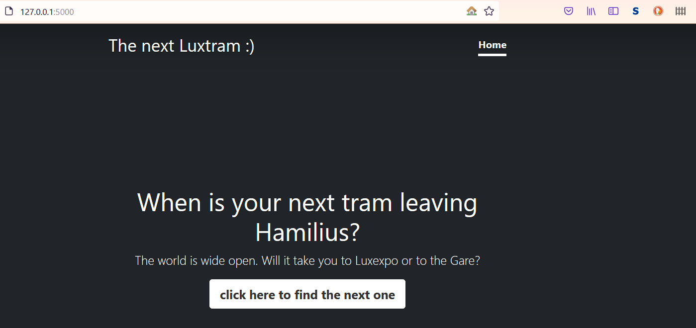
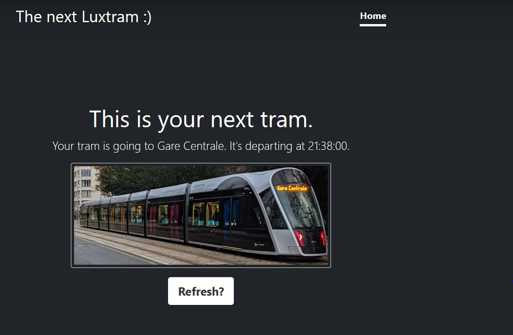

### Custom API Based Website

I followed this Udemy Course: https://www.udemy.com/course/100-days-of-code/

This course finalises with 20 challenges covering all aspects which were introduced during this course.

This project covers the challenge from day 95 (15th challenge). One of those challenges was building my own website:
https://jarmo2.github.io/ 
On this website you can find all the projects I have built inspired by _100 days of code_.
The instructions given for this project were as follows:
_Build a custom website using an API that you find interesting._

All you need to start this program is to run main.py.

In the console, a link to a flask server appears. Click on this link.
For the rest of the program, please navigate with the help of your browser.

As I used to live in Luxembourg, I designed this little website which grabs data from the hafas api.
In Luxembourg, there is only one tram line. This little app shows you if the next tram from the stop Hamilius depards towards the one or the other terminus.

This program uses flask, requests and bootstrap.

### Badges

#### 1. GitHub Stats
[My repository stats](https://github-readme-stats.vercel.app/api?username=Jarmo2&show_icons=true)
#### 2. Most Used Languages

##### 3. Random Joke Generator

##### 4. Profile View Counter

### Visuals

Start

Option 1

### Installation

For this simple program you need Python and the following libraries:
- Flask 
- requests

### Usage

It's an easy way to build a website about a topic I like. Requests and Flask offer a lot.

### Support

If you need help or if you have a comment please feel free to leave a comment on Github.

### License

gpl-3.0
