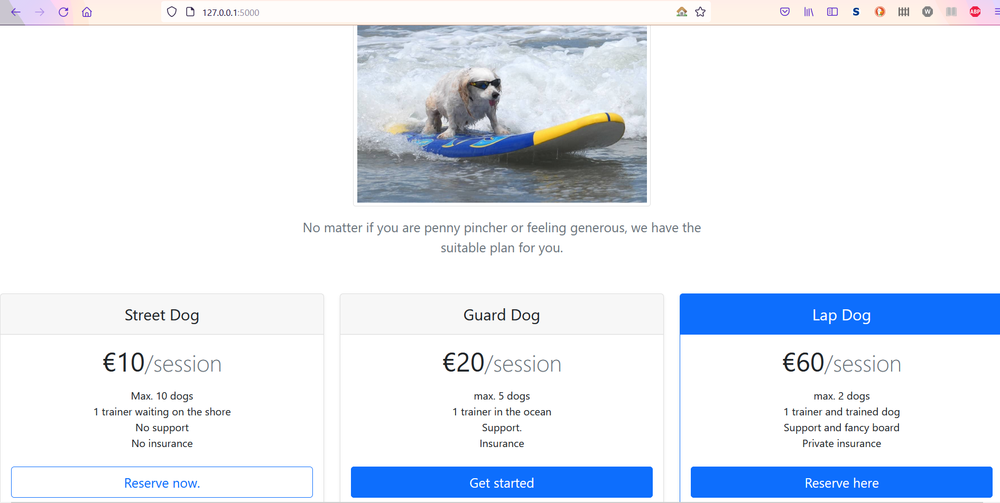
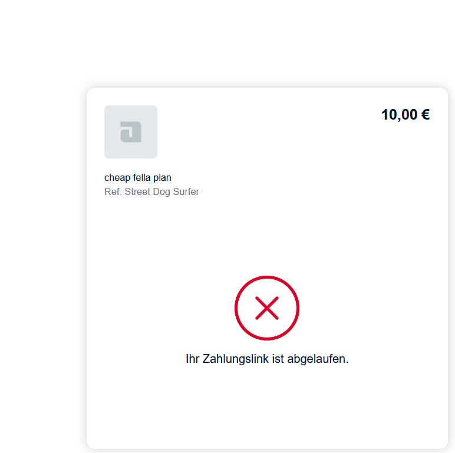

### An Online Shop

I followed this Udemy Course: https://www.udemy.com/course/100-days-of-code/

This course finalises with 20 challenges covering all aspects which were introduced during this course.

This project covers the challenge from day 96 (16th challenge). One of those challenges was building my own website:
https://jarmo2.github.io/ 
On this website you can find all the projects I have built inspired by _100 days of code_.
The instructions given for this project were as follows:
_An eCommerce website with payment processing._

With this program you can:
- book a silly entertainment - dog surfing
- manage your dog surfing sessions
- get a notification for your upcoming dog surfing sessions
- pay your dog surfing session online
- create a user account

# This program is still a work in progress and will be updated once I have mastered SQL and webhooks.

### Badges

#### 1. GitHub Stats
[My repository stats](https://github-readme-stats.vercel.app/api?username=Jarmo2&show_icons=true)
#### 2. Most Used Languages

##### 3. Random Joke Generator

##### 4. Profile View Counter

### Visuals

Start

Payment-Processing

### Installation

For this simple program you need Python and the following libraries:
- Flask 
- requests
- wtforms
- flask_wtf
- flask_sqlalchemy
- flask_bootstrap
- flask_login
- sqlalchemy.orm

### Usage

The aim of this program is to show how you can set up a very simple webshop and process a payment.

### Support

If you need help or if you have a comment please feel free to leave a comment on Github.

This program is a mock up only at the moment. I am still learning how to work with webhooks. This protocol is needed to work with the Adyen API.
In addition, I need to work on my SQL skills to allow a booking engine.
Moreover, with the help of SMTPlib a confirmation email shall be sent.
I also have to set up a VENV for my API keys.

### License

gpl-3.0
