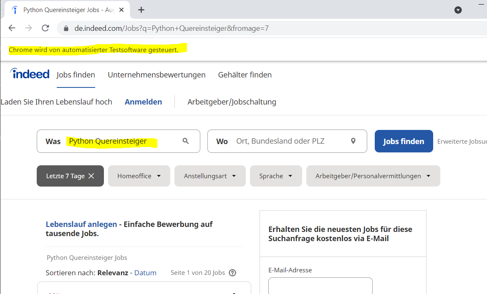
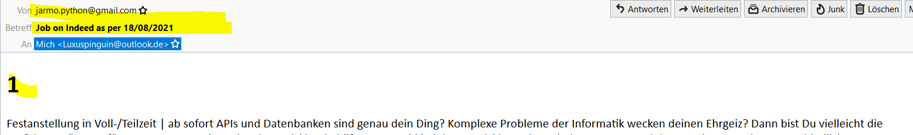

### Custom Automation

I followed this Udemy Course: https://www.udemy.com/course/100-days-of-code/

This course finalises with 20 challenges covering all aspects which were introduced during this course.

This project covers the challenge from day 97 (17th challenge). One of those challenges was building my own website:
https://jarmo2.github.io/ 
On this website you can find all the projects I have built inspired by _100 days of code_.
The instructions given for this project were as follows:
_Automate some aspect of your life using Python._

As I am approaching the end of the first part of my coding journey, I decided to build a small webscraper with the help of selenium which scrapes the job portal
indeed.com for German speaking Python jobs. The tool comprises the top 15 jobs and sends them via email.
So, I could refresh my skills for smtplib as well.
I also learnt how to hide my login credentials with the help of the os.environ.get() function.

### Badges

#### 1. GitHub Stats
[My repository stats](https://github-readme-stats.vercel.app/api?username=Jarmo2&show_icons=true)
#### 2. Most Used Languages

##### 3. Random Joke Generator

##### 4. Profile View Counter

### Visuals

Start

Summary mail

### Installation

For this simple program you need Python and the following libraries:

- selenium
- smtplib
- MIMEText

### Usage

The aim of the program is to show how a webscraper can be combined with smtplib.
I used Selenium to scrape a dynamic javascript website.

### Support

If you need help or if you have a comment please feel free to leave a comment on Github.

### License

gpl-3.0
