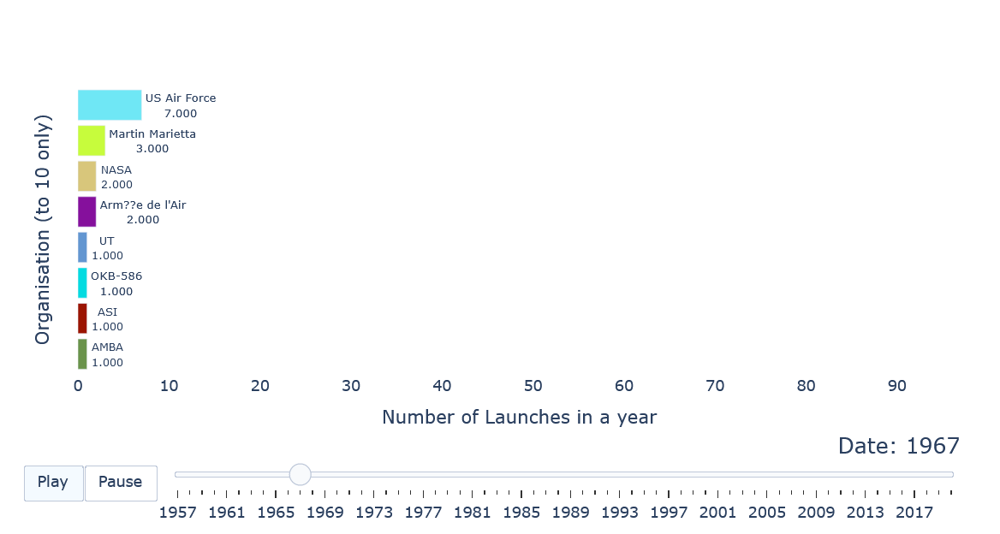
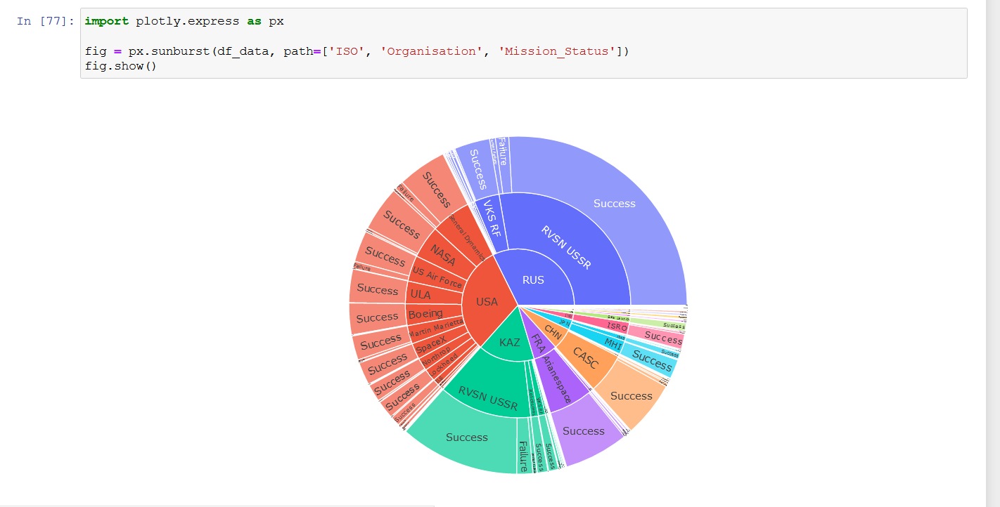
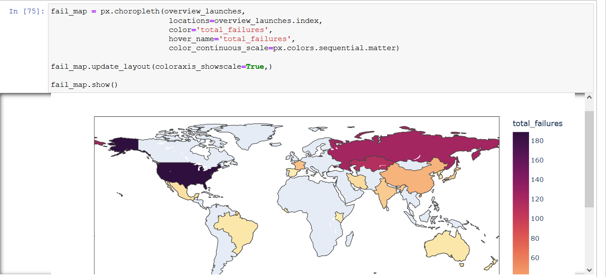

### Analyse and Visualise the Space Race

I followed this Udemy Course: https://www.udemy.com/course/100-days-of-code/

This course finalises with 20 challenges covering all aspects which were introduced during this course.

This project covers the challenge from day 98 (18th challenge). One of those challenges was building my own website:
https://jarmo2.github.io/ 
On this website you can find all the projects I have built inspired by _100 days of code_.
The instructions given for this project were as follows:
_Use space mission data from 1957 onwards to analyse and visualise trends over time._

This is my first data science project inspired by 100 days of code. When I started, I noted that my data science skills where not profound enough.
So, I increased my skills with the help of the best Python instructor on YouTube: 

[Corey Schafer Tutorial on Pandas](https://youtube.com/playlist?list=PL-osiE80TeTsWmV9i9c58mdDCSskIFdDS)

With the help of this tutorial I could solve this challenge. However, I decided to switch to Kaggle from now on.

### Badges

#### 1. GitHub Stats
[My repository stats](https://github-readme-stats.vercel.app/api?username=Jarmo2&show_icons=true)
#### 2. Most Used Languages

##### 3. Random Joke Generator

##### 4. Profile View Counter

### Visuals

Racing bar chart

sunburst chart

### Installation

For this simple program you need Python and the following libraries:

- numpy
- pandas
- plotly.express
- matplotlib.pyplot
- seaborn
- raceplotly.plots
- iso3166
- datetime
- dateutil

### Usage

This project helped me a lot to understand the basics of data analysis and data presentation. The tool plotly is quite helpful and delivers powerful graphs.

### Support

If you need help or if you have a comment please feel free to leave a comment on Github.

### License

gpl-3.0
